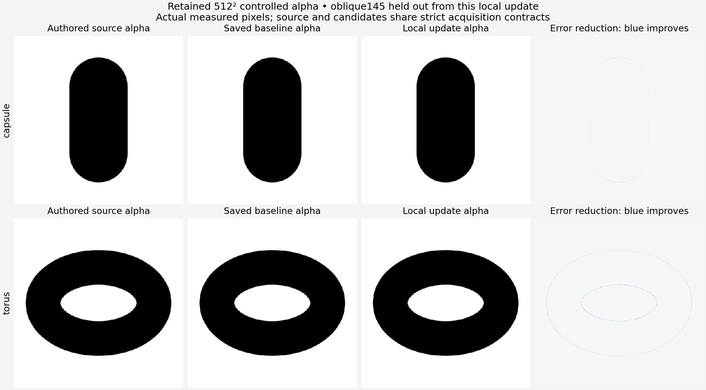

# Bounded adaptive family detail

The reusable local-update adapter covers four existing connected editable models. Eleven focused pure checks pass on the existing Blender-bundled Python 3.13.13. The completed capsule and torus checkpoint improves held-out alpha and raw mean surface distance under unchanged gates; the first failed transport history remains retained. Current twelve-row selections and all earlier evidence remain unchanged.

| Family | Physical update controls | Projection scope | Fixed controls |
|---|---|---|---|
| Capsule | cap radius, straight segment length | convex hull of the declared discrete connected capsule mesh | position, rotation, segment count, presentation intent |
| Tapered frustum | bottom radius, top radius, axial height | convex hull of the two declared discrete end rings | position, rotation, segment count, presentation intent |
| Torus | major radius, minor tube radius | exterior and hole ring boundaries; camera must look along the local ring axis | position, rotation, segment count, open-hole condition |
| Concave arch | opening width, cavity roof height | retained eight-corner planar notch; camera must look along extrusion axis | exterior, extrusion thickness, position, rotation, presentation intent |

The adapter updates explicit physical subsets in frozen positive intervals. Necessary capsule and frustum dimension aliases remain coupled to the physical controls. Arch opening edits retain the exterior and roof; roof edits retain the exterior and opening width. Other recipe fields survive. The discrete projection model supplies proposal residuals, not native or artist acceptance. Native evaluated arrays and retained measurements remain separate.

Detail evidence consists only of observed neighbouring half-coverage crossings. A clipped frame contributes its visible crossings without invented border closure or a complete-contour claim. At most384 crossings per acquisition contribute, with equal acquisition weights. The objective measures distance to the true projected exterior/hole boundary; internal triangle edges are excluded. A rank-deficient or interval-bound update stays underconstrained. Local full rank is recorded as local sensitivity, with global uniqueness explicitly false. A budget stop preserves the best completed recipe and does not invent missing sensitivity.

Crop selection wraps the existing controlled residual engine. It requires explicit availability of source geometry; fixed old images cannot supply new truth. A requested1024 crop is a new render of a160-cell512 viewport interval, never an enlargement labeled newly observed. Held-out view names are rejected by both fitting and ROI selection. The caller must explicitly disclose prior held-out exposure. Capsule baseline fitting previously used the old oblique display supports; torus baseline fitting used canonical views and later inspected old oblique admission. The new controlled held-out checkpoint is excluded from this local update, but those histories remain in the frozen plan.

[native-plan.json](native-plan.json) freezes the saved recipes, exact baseline geometries, completed owned receipts, original cameras, source inputs, 0.9..1.1 candidate-derived parameter intervals and runtime hashes. [preflight.json](preflight.json) records the exact standalone command. Planned scope is capsule plus torus: six source and six candidate frames, two updates of at most96 residual calls /1 second, two new raw4096-sample comparisons with seed61007, two verified baseline raw observations reused, and two family-specific native edit/restoration transactions. The outer ceiling is90 seconds,8 GiB and two threads. No qualifier children, display frames, neutral/normal campaign or automatic fit tuning is included.

The controlled measurements use opaque linear alpha with original camera declarations, EEVEE64,1.5 filter and float32 EXR. The area0.7 / boundary0.8 / signed-distance0.05 silhouette gates stay unchanged. The predeclared checkpoint compares one new held-out view, alpha L1, boundary IoU and raw mean surface distance. It cannot replace a current row whose full five-view, boundary and canonical inspection are required. Independent artist surface limits remain null. Root separately owns candidate-blind source engineering contracts; this adapter does not tune tolerances to candidate results.

Completed native resource and real-pixel evidence is bound in [evidence.json](evidence.json). No recovery or cleanup command is proposed. Saved input ownership checks are read-only and all new output uses a fresh owned directory.

The first native child joined with exit1 in8.074466 seconds and600,883,200 peak RSS bytes. Capsule produced all six planned EXRs, a14-call /.4785-second local update and exact saved d436a592... geometry. A NumPy-valued parameter propagated a NumPy boolean into the semantic response, preventing both case and failure JSON serialization. All33 owned artifacts remain verified under the failed/released owner. No torus acquisition ran. Controls now normalize to builtin floats, and the ninth focused fixture checks the nested semantic JSON transport. No old receipt is rewritten.

Read-only comparison of retained capsule alpha gives boundary IoU0.984654731 to0.986687148 and L10.000173569919 to0.000148054503; both strict gates pass. Local rank is two with no active bound. Raw and semantic verdicts were not persisted, so they remain unavailable. [capsule-retained-observation.json](capsule-retained-observation.json) records the recovered measurement observations without fabricating the missing results. The approved continuation reused all six capsule frames and its frozen recipe, with no capsule fitting or rendering, then recorded the missing raw/semantic stages and the previously unrun torus case.

The failed-only continuation joined successfully in8.179504 seconds with628,510,720 peak process-tree RSS bytes. It made exactly six new torus acquisitions, reused all six capsule acquisitions, ran one torus update and recorded two raw pairs/two semantic transactions. Both owners remain retained: the first failed/released33-artifact owner and the final succeeded/released42-artifact owner. Their files all match their ownership digests. No current source or selected row was mutated. The first-run script and adapter bytes are retained under `native-source-run01`, with hashes equal to the original frozen plan.

| Independent observation | Capsule baseline → local update | Torus baseline → local update |
|---|---|---|
| held-out ob145 boundary IoU |0.984654731 →0.986687148|0.985186574 →0.993036605|
| held-out controlled alpha L1 |0.000173569919 →0.000148054518|0.000304355024 →0.000148501626|
| relative alpha error reduction |14.700359%|51.207763%|
| raw mean surface distance, world |0.000297955525 →0.000283499570|0.000172927973 →0.000076015889|
| local calls / solver time |14 /.478501 seconds|14 /.044873 seconds|
| local sensitivity |rank2, no active interval bound|rank2, no active interval bound|
| exact semantic restoration |straight segment×1.05 passed|minor tube radius×1.05 passed|
| full changed-candidate five-view/boundary/canonical verdicts |unrun|unrun|
| independent artist surface limits |unavailable|unavailable|

Both held-out strict silhouettes pass and the predeclared local checkpoint improves. Capsule normal-angle P95 changes from2.681346 to2.681827 degrees; torus P95 changes from2.165446728 to2.165447103 degrees. These slightly higher independent normal observations remain visible; there is no normal-acceptance claim. The raw mean improvement is about4.85% /56.04% respectively. The final indexed candidates are d436a5924e7f8e7fca6dab582462a0794017721f3ca51a488403aee1cb2c2b6b and3afacdc32a140a1099cd304b101d8910a7e6e58701b3608f947039aaf2349417. No global uniqueness is established.

The complete512-square source/baseline/refined pixels were inspected, together with both genuine1024 detail crops. The capsule remains connected and the ring hole remains open. Both crops visibly cross their frame borders, consistent with the recorded censored-contour scope. The fine changes appear as narrow boundary/AA improvements, not a new large visible shape. [pixel-evidence.json](pixel-evidence.json) binds the exact retained arrays and display scaling; the figure performs no acquisition or fitting. [quality-checkpoints.csv](quality-checkpoints.csv) records the numeric comparison.

Frustum and arch share the bounded update implementation and pass pure recovery/fixed-parameter tests; native adaptive experiments remain unrun. The useful next engineering step is the remaining controlled validation cameras and independent geometry/semantic verdicts for any candidate proposed as a current-row replacement. Root owns candidate-blind source engineering contracts and canonical recapture. Original legacy missing clip/shift/camera-binding provenance stays explicit; actual matching clipping/shifts are captured by the new controlled contracts only.
