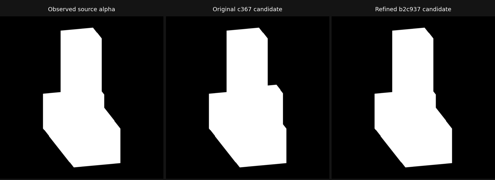

# Frozen actual family coverage continuation

Ten new family candidates have measured geometry and passed all 50 required silhouette views. Two previous actual results (vase and rounded triangle) were reused, so all twelve frozen families now have actual reconstruction evidence. The retained original multipart candidate had an underconstrained endpoint; the later one-scalar observation/refinement below identifies it locally. No row is aggregate accepted: independent surface tolerances remain null, and legacy reference camera bindings retain explicit gaps.

The measurement protocol is the original five 512-pixel views and frozen black/white AgX sources, decoded for fitting with the explicit calibrated LUT. These receipts are not controlled-linear alpha coverage. Human neutral and RGB world-normal previews are separate retained artifacts. The strict silhouette gates remain area IoU >= 0.7, boundary IoU >= 0.8 and normalized signed-distance loss <= 0.05 on every view.

Every new recipe was saved before reference geometry arrays were read. Fits used only observed masks, explicit coverage and camera declarations. Surface comparison used unchanged world geometry, 4,096 samples per direction and seed 61007; it reports distances and oriented geometric-normal angles without a family acceptance threshold.

The table retains the original ten candidate metric receipts. The current refined multipart selection and its independent metrics appear below.

| Family | Mean distance (world) | Normal P95 (degrees) | Worst boundary IoU | Boundary | Specific source control |
|---|---:|---:|---:|---|---|
| anisotropic_ellipsoid | 0.000325119518 | 3.92739106 | 0.974366573 | qualified | passed |
| capsule | 0.000297955525 | 2.68134633 | 0.98528113 | qualified | passed |
| cylinder | 0.000580631289 | 2.05531887 | 0.969511326 | qualified | passed |
| rounded_box | 0.000245377035 | 7.10429971e-05 | 0.885587993 | qualified | passed |
| sphere | 0.000428304737 | 4.09235528 | 0.971041353 | qualified | passed |
| tapered_frustum | 0.000507923002 | 2.05716467 | 0.953336149 | qualified | passed |
| thin_plate | 0.000664459167 | 0.0179606921 | 0.944431635 | qualified | passed |
| concave_arch | 0.00112426248 | 8.53773646e-06 | 0.869601329 | qualified | passed |
| torus | 0.000172927973 | 2.16544673 | 0.979644539 | qualified | passed |
| asymmetric_multipart_solid | 0.00420164529 | 0 | 0.853192303 | qualified | passed |

The seven convex candidates have separate exact boundary qualifications and specific source-parameter edit/restore transactions, bound to the original indexed geometry hashes. Their original preparation receipts still contain the earlier topology-only and object-scale observations. The JSON preserves both layers without rewriting prior evidence. Arch cavity/occupancy probes passed; torus retained the observed annular hole. The separate arch/torus saved-boundary follow-up also passed under unchanged 15-second helpers (12.985 s outer / 348,291,072 peak RSS); their later specific semantic controls also passed in a separate receipt: arch cavity opening width x1.10 with outer outline, roof and extrusion depth fixed; torus tube radius x1.05 with major radius fixed. Both retain the same source/root pointers and exact indexed restoration, without blanket editability qualification.

All 150 candidate images are readable, hashed and bound by the producer to unchanged geometry and actual camera snapshots. Every mask, neutral and normal pass replays the same original camera declaration. Canonical inventories still report incomplete because strict legacy-reference frame comparison differs after native matrix decomposition; old source clipping was not recorded. These gaps were not relaxed. A separate 35-frame authored-source neutral pass now matches all seven convex candidate actual camera frames and clipping exactly; it does not rebind old masks or create missing source normals.

Pixel inspection covered rounded-box side/top bevels, thin-plate side depth, primitive facets, arch side and oblique cavity, and torus top neutral and side RGB normals. Flat primitive facets remain visible. The arch oblique preview retains clipping present in the frozen camera workload.

[coverage-evidence.json](coverage-evidence.json) records exact geometry/OBJ/program/camera identities, raw metrics, complete per-view silhouette verdicts and artifact bindings, resource receipts and preserved failed stages. The seven-family inspection took 16.403 s / 596,307,968 peak RSS for 105 frames. The arch/torus inspection took 10.676 s / 574,013,440 peak RSS for 30 frames, within 120 s / 8 GiB / two threads. No inspection reran fitting, raw metrics or qualification children.

Preparation chronology is retained: initial clipped support failures; one-sided censored support correction; flawed rounded-box empty-root bevel; mesh-descendant world-radius repair; refused lossy world-NPZ replay; 46 partial frames from the camera/UV order guard; then exact saved-program replay with strict indexed hashes. No old receipt was deleted or modified.

The direct and routed APIs enforce 1..512 integer residual calls (excluding bool) and finite >0..10-second allowances. The torus implementation explicitly requires canonical top +X/+Y basis and a Z-axis ring; rotated inputs are rejected. Future inventories mark supported arch/torus and multipart rows unrun when unselected, with an explicit separate runner route for multipart; the convex API still refuses multipart. Convex proposals still reject holes. Twenty-five focused pure regressions pass in the existing bundled Python. Root registers these suites in test_runner.

Remaining work includes independent candidate-blind family noise limits and legacy mask/camera/clipping provenance. The later multipart scalar observation is locally identified; global hidden-surface uniqueness remains unqualified. New controlled-alpha observations are kept separate from the frozen display protocol. See the [root calibration ledger](../quality-calibration-20261008/README.md) for boundary/performance updates. The approved multipart plan is in [multipart-proposal.md](multipart-proposal.md).

The paired source-neutral inspection identified a rounded-box style gap: the authored source also has WEIGHTED_NORMAL. Future rounded-box recipes now explicitly opt in with weighted_normals=True through the compiler boolean contract; other family shading remains unchanged. The original 135-frame recipes and images remain intact, and style verification belongs to a fresh separate receipt.

Multipart was fitted from front/side/top plus censored oblique_35_28 only. The saved recipe preceded reference-array reads; oblique_145_40 pixels were not decoded during fitting. Its short-arm far-depth endpoint reached the upper bound of the original interval [-0.290303782, 0.325264539]. The local residual rank was four, but the saved-only admission explicitly retains this endpoint as underconstrained. The held-out view still passed area 0.979911580 / boundary 0.853192303 / signed-distance loss 0.004344109, showing why silhouette admission is independent of surface fidelity. Raw mean distance is 0.00420164529 world, P95 0.000353157520 and sampled max 0.180239215493; normal mean is 2.40600586 degrees and P95 is zero. No family surface threshold was invented or tuned from this result.

The multipart model retains three editable boxes and two live Exact UNION modifiers. Base width, tall-arm height and short-arm depth each changed the actual union and restored its exact indexed hash with the same source/mesh pointers. Its topology screen is one oriented closed component, 24 vertices / 44 triangles / Euler 2; the separate native boundary follow-up passed under unchanged 15-second helper (10.168 s outer / 337,551,360 RSS). The geometry continuation used 23 residual/probe calls in 0.435 s and took 6.632 s / 278,855,680 RSS overall. Saved-only fifteen-frame inspection took 8.048 s / 550,617,088 RSS, with no fit/raw/qualifier rerun and exact c367746d... indexed identity. The earlier pre-recipe clipped-view failure is preserved. Pixel inspection covered the held-out oblique, side thickness and top RGB normal pass.

Future rounded recipes additionally declare bevel_segments=8 and weighted_normals_keep_sharp=False, matching the predeclared producer tessellation and authored normal style. Old recipes retain the legacy adapter and every prior render receipt. No prior measurement protocol or threshold was relabeled.

All ten new saved boundaries now qualify independently. The final combined focused run passed 25 pure checks (11 frozen, six structured, eight multipart). Core and evidence are ready for root local integration; no push, publication or old-artifact mutation occurred.

A separate controlled complementary view at -15 degrees azimuth / 20 degrees elevation exposed the hidden short-arm depth. Exactly two 512 linear-alpha frames used matched acquisition SHA 0c3be759b6c683eec1710562dd737c4b2caf07b951cc1d23474c04bf677a64c8; source and candidate were uncropped and remained exactly unchanged. The source regenerated the original indexed hash 2142108d..., while the candidate retained c367746d.... Area IoU was 0.948362255, boundary IoU 0.787340565 (failed the unchanged 0.8 gate), signed-distance loss 0.007346599 and diagnostic linear coverage L1 0.015025837. The candidate added 3,914 foreground pixels along the short arm. The 6.670-second / 546,091,008-RSS session performed no fitting, raw comparison or qualification. This new observation remains separate from the original fifty passing display-calibrated views. A one-scalar endpoint correction is proposed with old oblique145 excluded; it has not run.

The approved one-scalar follow-up produced b2c937a9... by changing only short-arm far Y from 0.325239246 to 0.144848283. All other saved parameters remained fixed. It used 22 residual calls / 0.152 s with exact projected union boundaries, and fitted only the new controlled source alpha/actual camera within the original interval. The endpoint is locally observable and no longer bound-active; the original interval is still recorded without a global hidden-surface uniqueness claim.

All five original display-calibrated gates and the new controlled gate passed. New-view boundary IoU rose from 0.787340565 to 0.994246722; linear coverage L1 fell from 0.015025837 to 0.000204924 (98.636 percent). The original oblique145 was excluded from fitting and improved independently from boundary 0.853192303 to 0.991509176. The raw comparison with 4,096 samples per direction and seed 61007 reduced mean world distance from 0.00420164529 to 0.000161977557 (96.145 percent) and sampled max from 0.180239215493 to 0.000502134732; P95 stayed 0.000353157520. Geometric normal mean fell from 2.40600586 to 0.0329589844 degrees; P95 stayed zero. Independent family limits remain null.

The exact new mesh passed the unchanged 15-second native boundary helper and one short-depth x1.05 transaction with the same source/mesh pointers and exact indexed restoration. The entire session took 17.141 s / 701,136,896 peak tree RSS for exactly six candidate frames, one new raw comparison (verified original baseline reused), one qualifier and one control. Pixel inspection confirmed removal of the protrusion. The new row has five retained mask passes and one controlled alpha frame; its neutral/normal passes remain explicitly unrun. The original c367 geometry, its fifteen canonical frames, and failed complementary observation remain untouched. Current multipart selection is explicit in coverage-evidence.json rather than rebinding prior artifacts.

The [final ownership audit](multipart-final-audit.json) verified all observation, endpoint and qualifier artifact hashes, released leases and succeeded producer states with no unknown files or blockers. It is read-only; no deletion or lifecycle adoption occurred. Core files and this evidence are stable for root integration.
