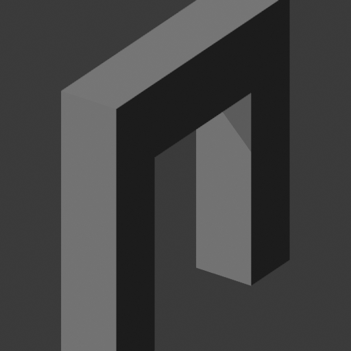
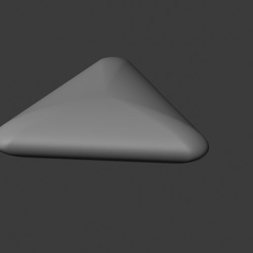

# Arch and triangle tail refinement, 2026-10-09

The completed checkpoint repairs the arch tail error. The triangle proposal improves raw tails but is rejected by its independent held-out alpha rule. Both outcomes, two failed native attempts, three CPU owners and the original selected bodies remain retained. Current demo/12-row selection is unchanged; artist limits remain null and aggregate acceptance false.

[native-evidence.json](native-evidence.json) contains exact results, resource receipts, twelve separate read-only ownership audits and four original PNG bindings. [native-plan.json](native-plan.json), [launch-command.json](launch-command.json) and [preflight.json](preflight.json) preserve the executed missing-only scope. Runtime/recipe inputs were verified after native join before the shared runtime freeze was released. Later shared integration is independent of this job-time evidence.

## Actual outcomes

| Independent result | Arch4910 | Triangle ddbf |
| --- | --- | --- |
| Original five strict silhouette gates | passed | passed |
| Actual single-solid boundary | qualified, uncached3.380851 s | qualified, uncached6.160551 s |
| Physical response / exact indexed restoration | passed | passed |
| Raw mean distance, baseline to proposal | 0.000229571103 to 0.000087607194;61.84% lower | 0.000673231912 to 0.000592012192;12.06% lower |
| Raw P95 distance | 0.002919286489 to 0.000378489494;87.03% lower | 0.002251193416 to 0.001490326528;33.80% lower |
| Raw sampled maximum | 0.002919286489 to 0.000378489523;87.03% lower | 0.002981405240 to 0.002337187761;21.61% lower |
| Geometric normal P95 | unchanged0.000008537736 degrees | 1.465914305 to 0.101404733 degrees;93.08% lower |
| Original ob145 alpha L1 | 0.000211896448 to 0.000102741702;51.51% lower | 0.000413024507 to 0.000562167377;36.11% higher |
| Bounded checkpoint | true | false: held-out alpha regression |
| Artist / aggregate | null / false | null / false |

Arch baseline is `e2b54f3511ccca10d456c3c52ac78ff2deb13915bf36905544e1943294b95e6c`; proposal `4910fa0f6defa8b476aa95a82b80d5d41f2d820f01afccc613e8b7d18d3e8470`. Triangle baseline is `bfe727380abc81d0215abec5687b77b83c251133605149a6f7ad2f714423a89d`; proposal `ddbf0ecf63d78353bbb79b92b8152228c0760979c93bf980084a6184b3ed03ab`.

The conjunction requires all five original area0.7/boundary0.8/SDF0.05 gates, original ob145 alpha L1 nonworse, raw mean/P95/sampled maximum nonworse, exact edit restoration and actual single-solid boundary qualification. Triangle raw and normal improvements do not override its independent alpha rejection. These are bounded engineering comparisons, not invented artist tolerances or aggregate approval.

## Diagnosis and source-only fitting

A bounded diagnostic of256 deterministic source samples against every candidate triangle localized the arch's prior P95 rise to its flat cavity roof. The exterior stage had fixed the bottom-relative notch dimension while moving outer height/bottom. The follow-up varies only `notch_height_from_bottom_world`, the same physical dimension stored by `cavity_roof_height_world`. Outer width/height, opening width, extrusion depth, rigid frame and topology remain fixed at e2b. Its observed constraint is the previously acquired, uncropped expanded ob35 linear alpha. Projection uses the actual concave triangle union, without internal triangle edges as silhouette evidence.

The triangle's remaining tail was on lower/front sloping dome surfaces despite full authored corner32/dome64 tessellation. Its follow-up varies only world Y/Z center and front depth fraction. X center, orientation, total thickness, outline scales, corner radius and actual6239-vertex discrete mesh remain fixed. It uses retained front/top linear-alpha source observations.

Reference meshes were inspected only for independent diagnosis. Neither optimizer consumes reference arrays or authored dimensions. Bounds come from selected controls/source pixel steps. Original ob145 had prior selection/metric/presentation exposure, explicitly disclosed; it is excluded from fitting, bounds and ROI choice. The later held-out rejection remains independent.

Both stages use at most96 residual calls and a one-second fit budget, with local-rank reservation. Only observed internal half-coverage crossings contribute; artificial frame-border closure is forbidden. Equal-view L4 residuals use source-pixel units. Retention requires observed mean absolute/P95/max all nonworse, full local rank and no active bound. Local identifiability does not establish global uniqueness.

| CPU result | Physical controls | Mean absolute contour px, old to proposal | P95 px | Max px | Actual fitting |
| --- | --- | --- | --- | --- | --- |
| Arch roof | notch height1.29960368904062 | 0.046998046 to0.029674513 | 0.092575646 to0.063109202 | 0.449354325 to0.108373949 |33 calls,0.2413503 s,rank1 |
| Triangle dome | Y0.000022228765581030867; Z-0.0005205612606806178; front fraction0.49975207897565155 | 0.150737190 to0.114293507 | 0.421516946 to0.211945255 | 0.524644109 to0.322646894 |65 calls,0.6523627 s,rank3 |

CPU owners under `tail-contour-cpu-01` remain unchanged: `owned-j51vn8ro` failed/released after saving the arch proposal due to a scratch NPY-file-versus-array-payload SHA comparison; `owned-nmdlk8dy` succeeded/released its receipt but retained original triangle controls after timing/rank rejection; `owned-er25pj8u` succeeded/released the two admitted CPU recipes. The arch recipe is reused without refitting. Older stage observations are retained as history scoped to their exact baseline geometry/recipe.

The saved proposal SHAs are arch `76dc835cd7d73e67426e2cedbdaa32ac8ec4bf9cf684a38008cb88f751af5d3d` and triangle `9150d659097fdaf33b6aa006541b7599ebaa536ed4db15cb6f4ac9544907a626`. Eight focused model guards and two changed wrapper guards passed; no broad suite was used.

## Actual process and artifact scope

Producer `tail-checkpoint-03/owned-nzlocu3s` completed exactly seven new512-square frames and verified five retained arch alpha frames, for twelve logical frames. New work is five triangle alpha frames and one candidate ob35 neutral per family. Source neutral images are reused with exact original SHA/settings/body/frame/clipping bindings; there are zero new source acquisitions or native fits. Each case has one raw4096-per-direction/seed61007 pair, one physical edit/restoration and one uncached15-second-cap known-package boundary helper. Edits are arch notch height times1.005 and triangle front fraction times1.01.

Producer elapsed16.4526217 seconds; outer supervisor `tail-supervisor-03/owned-vylrpq8r` elapsed29.1004745 seconds under85-second work plus5-second joins,8GiB committed/RSS and two declared threads. All eight observed process HANDLEs joined exit0; Job active count reached zero. Peak sampled RSS728,895,488 bytes, peak committed memory2,775,195,648 bytes. The producer, supervisor and both separately owned sibling helpers released. All twelve fresh CPU/failure/validation/native audits are `dry_run_ready`; no reclamation or adoption occurs.

All126 ordinary inputs,24 separately capped retained inputs and three existing toolchain binaries matched frozen hashes after native join. Retained input inventory is capped at32 files/64MiB; ordinary inventory remains capped at128 files. Large toolchain hashes are streamed under512MiB/file and512MiB aggregate. Supervisor uses16 explicit critical inputs under its unchanged64-input/256MiB cap. Producer reserves56MiB for seven frame writes plus16MiB geometry/metadata under256MiB. No install, version change or helper fallback occurs.

## Preserved failures and strict camera repair

[failed-bootstrap-01/failure-evidence.json](failed-bootstrap-01/failure-evidence.json) preserves the exact first plan/source/command and supervisor `owned-hp9d5zk9`. It exited before a producer or measurement existed because validation imported evaluation before the existing package bootstrap and could not find cv2 under Blender's disabled Python user site. The original failure/released lease is unchanged. The correction moves the existing `test_runner` bootstrap before validation; no installation occurs. Bundled Python `-s` exercised the exact validate-only CLI under a fresh bounded supervisor, without bpy/render/fit/raw/edit/helpers.

[failed-camera-02/failure-evidence.json](failed-camera-02/failure-evidence.json) preserves the exact second63fc/6704 packet/source and failed/released producer `owned-s5vv80kc`, supervisor `owned-h_bg_kof`. Five arch alpha frames completed before a neutral-frame assertion. Alpha's actual camera was captured after native evaluation; neutral was read immediately after assigning the original matrix, before evaluation.

The final c413 continuation reuses exactly those five completed frames with original failed producer, released lease, recipe/body, file SHA and acquisition bindings. Completed frames are not rerendered or copied into new ownership. Original declaration replay is followed by `view_layer.update()` before neutral capture. Expected alpha, bound source alpha, before-update and after-update records are published before strict assertion; post-render actual camera is published and checked again. No tolerance, camera-model change or reassignment of an evaluated measured matrix is introduced. The source neutral pairing is also checked against its bound source alpha frame. Remaining changed-body neutral/normal views are unrun.

Executed plan SHA `c41366df0e5b45cba910b960387cd881ee485d484548240dfa93be1f4d406e3e`; launch SHA `1ab062e76cb67c992698218556352fd9919c40d123b91361e11ee694c53c9624`; preflight SHA `df5f660495b886dbbd45abde1caee68662e36a92f0da3d1c4b8c8a2411d6ef30`; checker SHA `34c0f5525cb3f7dd7ade0a598d87bb19ec6fcc152c66af82f9dc9d7b0e435bba`. Historical packets retain their own exact identities.

## Real paired pixel inspection

Root viewed all four actual512-square ob35 PNGs at original resolution. Arch source/candidate retain the same historical top/bottom clipping, with corrected roof location. Triangle source/candidate retain authored visible shading bands and left clipping, without obvious broad style drift. Representative inspection does not replace held-out evidence or complete unrun views. Copies below preserve the entire original file bytes and native producer SHA.

Arch source and passing proposal:

Triangle source and rejected proposal:

Root separately authorized one CPU-only triangle correction using the existing bound front/top/originalob35 alpha, fixed physical template and96-call/one-second budget. Original ob145 remains excluded with prior exposure disclosed. No new source/native campaign or selection promotion is authorized before concrete review. The ddbf rejection stays unchanged.
